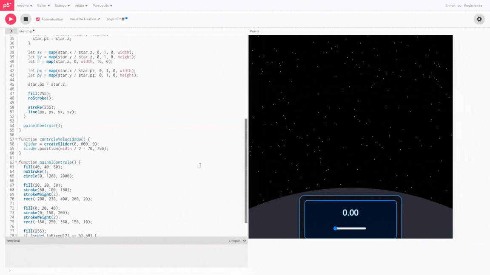

## 📜 Resumo

Para o projeto integrador do 1° semestre de <b>ciências da computação</b>, foi proposto desenvolver um sketche em <b>p5.js</b> com o tema "Forças da Natureza" e abrindo brechas para a criatividade dos estudantes. O seguinte projeto foi inspirado em cenas clássicas de hiperespaço em Star Wars com sua natureza de incríveis artes da galáxia e exploração espacial.

## 📹 Gameplay

## 🎮 Onde visualizar

* Você pode acessar o link do projeto e executar o dentro da plataforma do p5.js clicando [aqui](https://editor.p5js.org/devpaulorcc/sketches/X-3-BKC_M).
---

### Como Interagir

**Acelerar**: Mova o `slider` na tela e veja o efeito hiperespaço. 

### Objetivos do Projeto

- **Efeito 3D**: Criar efeito 3D usando a sintaxe do p5 e Javascript com um array de estrelas com posições X, Y para o 2D e Z para 3D (profundidade).
- **Recriar ambiente**: Criar ambientação de espaço e nave, assim, simulando as cenas clássicas de hiperespaço em Star Wars.

## 👥 Dupla do projeto

* [Paulo Ricardo](https://github.com/devpaulorcc)
* [Erick de Luca](https://github.com/erickdeluca)